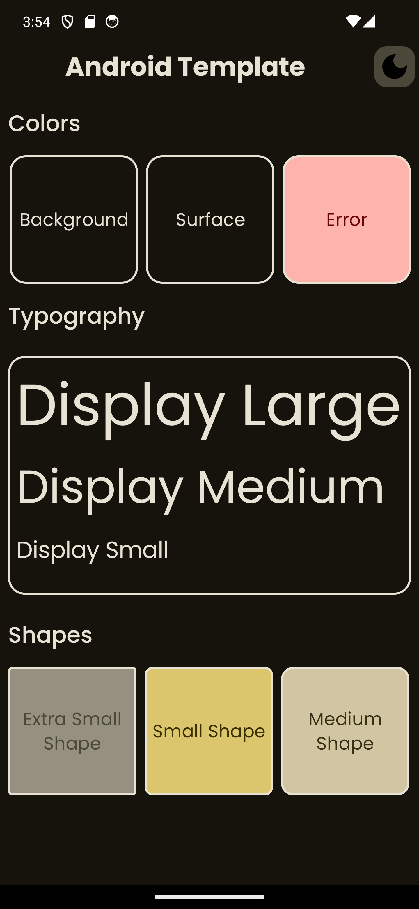
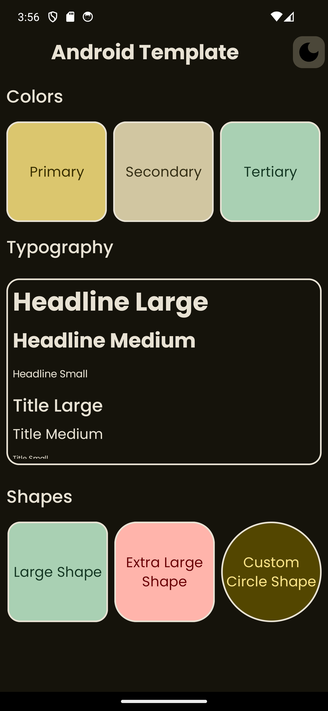
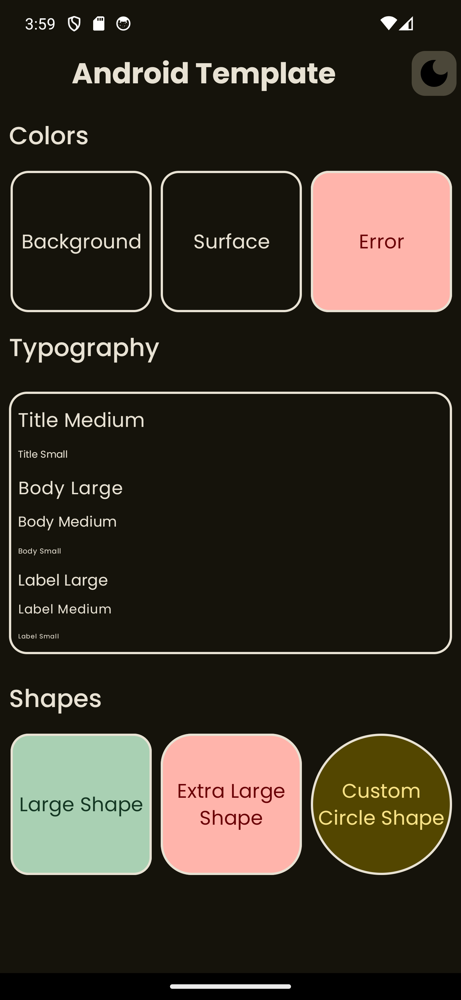
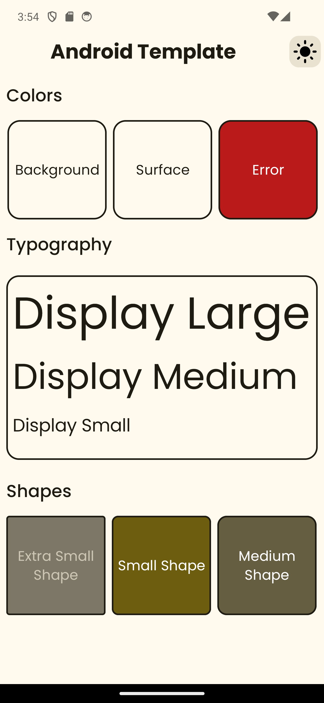
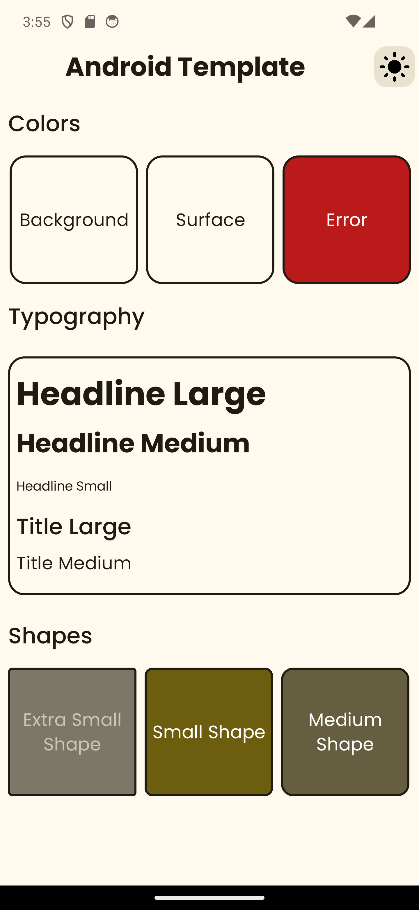
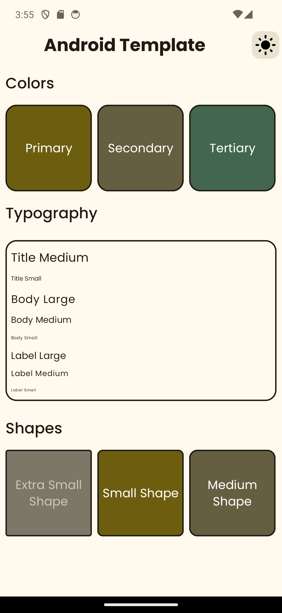

# Android Template Repo
This is a template repo for android project, it has convention plugin to allow sharing the build config with other
modules, it also uses modern build style like using toml file for version management and etc.

# Screenshots

Below are the screenshots of the application in dark and light themes.

| Theme     | Screenshot 1                               | Screenshot 2                                   | Screenshot 3                                   |
|-----------|--------------------------------------------|------------------------------------------------|------------------------------------------------|
| **Dark**  |    |    |    |
| **Light** |  |  |  |

# Todo : Add more detail about each convention plugin available in this repo.

# Annexure

In a standard AOSP tree, we won't usually find a .jks, but .pk8 and .x509.pem can be found at  "build/target/product/security/"

# 1. Convert the platform.pk8 to a format OpenSSL understands
openssl pkcs8 -in platform.pk8 -inform DER -outform PEM -out platform.priv.pem -nocrypt

# 2. Combine the private key and the certificate into a PKCS12 file
openssl pkcs12 -export -in platform.x509.pem -inkey platform.priv.pem -out platform.p12 -password pass:android -name platform

# 3. Import that PKCS12 file into a new JKS keystore
keytool -importkeystore -deststorepass android -destkeystore platform.jks -srckeystore platform.p12 -srcstoretype PKCS12 -srcstorepass android

### A Guide to Convention Plugins

* https://medium.com/@sridhar-sp/simplify-your-android-builds-a-guide-to-convention-plugins-b9fea8c5e117

### What is a script plugin

* https://docs.gradle.org/current/userguide/custom_plugins.html#sec:build_script_plugins
* https://docs.gradle.org/current/samples/sample_convention_plugins.html#compiling_convention_plugins
* https://docs.gradle.org/current/userguide/test_kit.html
